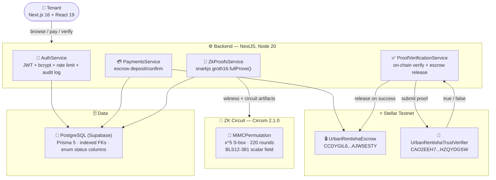

<div align="center">


# 🏠 UrbanRentisha TrustLayer

### Privacy-preserving rental trust infrastructure on Stellar

[](https://stellar.org)
[](docs/zkproof/UrbanRentisha_TrustLayer_ZK_Proof_Documentation.md)
[](TECH_STACK.md)
[](SECURITY.md)
[](CHANGELOG.md)
[](LICENSE)

> **[Stellar Hacks: Real-World ZK](https://dorahacks.io/hackathon/stellar-hacks-zk)** — Stellar Development Foundation

</div>

---

A tenant proves a required viewing/reservation payment was made — using a real zero-knowledge proof, verified on-chain by a Soroban smart contract — without exposing wallet history, and only then receives access to a verified property's viewing details.

## 🔑 Judge Demo — Live Credentials

**Live site:** https://urbanrentisha-web.vercel.app — login as `tenant1@urbanrentisha.local` / `TenantPass123!` and try the real flow described below. Full credential table, step-by-step walkthrough, and a video script in **[DEMO_GUIDE.md](DEMO_GUIDE.md)**.

## 🔁 The trust flow

```text
Tenant requests viewing on a verified listing
    -> Tenant pays the viewing fee on Stellar testnet (Soroban escrow contract)
    -> Backend generates a real Groth16 proof (Circom circuit, BLS12-381)
    -> Proof is verified on-chain by a Soroban smart contract (BLS12-381 pairing check)
    -> UrbanRentisha unlocks the viewing code / agent contact details
    -> Audit log records every stage (payment, proof generation, verification, unlock)
```

The proof is load-bearing: access stays locked until on-chain verification returns `true`. See [docs/zkproof/UrbanRentisha_TrustLayer_ZK_Proof_Documentation.md](docs/zkproof/UrbanRentisha_TrustLayer_ZK_Proof_Documentation.md) for the full proof design (statement, inputs, lifecycle, failure states, and the documented MVP limitations below).

## 🔗 Live Contracts — Stellar Testnet

| Contract | Address | Role |
|---|---|---|
| 🪪 `UrbanRentishaTrustVerifier` | [`CAO2EEH75TIJWGQEMKIO2RLDPWHQJ7HLDTG7HVYYGS6ZEV62HZQYDGSW`](https://stellar.expert/explorer/testnet/contract/CAO2EEH75TIJWGQEMKIO2RLDPWHQJ7HLDTG7HVYYGS6ZEV62HZQYDGSW) | Groth16/BLS12-381 on-chain proof verification |
| 🔒 `UrbanRentishaEscrow` | [`CCDYGIL6TW3CDBYUOOZFEY7LJXCY35AFTS3FGIMIG37PYMKAAJW5ESTY`](https://stellar.expert/explorer/testnet/contract/CCDYGIL6TW3CDBYUOOZFEY7LJXCY35AFTS3FGIMIG37PYMKAAJW5ESTY) | Viewing-fee deposit, release, and refund |

**Network:** Stellar Testnet · Horizon `https://horizon-testnet.stellar.org` · Soroban RPC `https://soroban-testnet.stellar.org`

## 🏗️ System Architecture



Full diagram (frontend layer, admin services, analytics) in [TECH_STACK.md](TECH_STACK.md).

## 🔐 ZK stack — what's actually implemented

- **Circuit:** [Circom](https://docs.circom.io/) (`circuits/payment-proof/payment_proof.circom`), compiled with `--prime bls12381` to target Stellar's native BLS12-381 pairing host functions.
- **Proof system:** Groth16, via `snarkjs`. The backend (`src/zk-proofs/zk-proofs.service.ts`) calls `snarkjs.groth16.fullProve()` against the real circuit artifacts (`.wasm` + `.zkey`) to generate a real proof — this is not mocked or simulated.
- **Commitment scheme:** the circuit proves knowledge of a private `(paymentSecret, paymentNonce)` pair binding to a public `paymentCommitment` via `MiMCPermutation` — a one-way permutation over the BLS12-381 scalar field using the `x^5` S-box, 220 rounds. The round count matches the security margin circomlib documents for its own MiMC implementation (`5^rounds` must exceed the field size for algebraic-attack resistance); an earlier 12-round version of this circuit did not meet that bar and was corrected before this submission. See section 6.2 of the ZK proof doc for the full writeup, including an earlier, genuinely non-binding quadratic relation that was also caught and replaced.
- **On-chain verification:** a Soroban contract (`contracts/trust-verifier/`) implements Groth16 verification directly using `env.crypto().bls12_381()`'s native `g1_mul`/`g1_add`/`pairing_check` host functions — real pairing-based verification, not a stub.
- **Deployed on Stellar testnet:** contract ID `CAO2EEH75TIJWGQEMKIO2RLDPWHQJ7HLDTG7HVYYGS6ZEV62HZQYDGSW`. Verified live via `stellar contract invoke`: a valid proof against this contract returns `true`; a tampered public input returns `false`.

**Curve note:** this project uses BLS12-381, not the newer BN254 host functions introduced in Protocols 25/26 ("X-Ray"/"Yardstick"). BLS12-381 support predates those protocols and is the curve used by Stellar's own canonical `groth16_verifier` reference example (`stellar/soroban-examples`), so this is the same curve choice as the official reference path, not a workaround.

**Honest limitation:** the MiMC permutation above is a minimal, self-contained construction sized to match circomlib's documented security margin — it is *not* an independently audited Poseidon/MiMC parameter set. Production use should adopt a standard, audited primitive for this field.

## 🏢 Beyond the ZK core

The rest of the platform (NestJS backend, Next.js frontend) implements the surrounding product: listing verification, agent/landlord onboarding, Stellar testnet escrow payments, viewing-code unlock, fraud reports, audit logging, rate-limited auth, and admin tooling. This is real, tested code (Prisma + Postgres, JWT auth, role-based guards) — not scaffolding — but it is supporting infrastructure around the ZK core described above, which is the part directly relevant to this hackathon's judging criteria.

## 📁 Repository layout

```text
backend/                       NestJS backend (API, Prisma, Stellar SDK, ZK proof workflow)
circuits/payment-proof/        Circom circuit, build artifacts, Groth16 ceremony outputs
contracts/trust-verifier/      Soroban Groth16/BLS12-381 verifier contract (Rust)
contracts/escrow/              Soroban escrow contract (deposit/release/refund)
frontend/                      Next.js app
docs/zkproof/                  ZK proof design: statement, inputs, lifecycle, security/privacy rules
docs/contracts/                Soroban smart contract design docs
docs/system-architecture/      System architecture documentation
docs/api/                      API endpoint catalog
docs/roadmap/                  Build roadmap
docs/deployment/               Deployment docs
qa-screenshots/                Before/after screenshots for every screen, against the real running app
TECH_STACK.md, SECURITY.md,
CHANGELOG.md, CONTRIBUTORS.md  Project documentation (see below)
CLAUDE.md                      AI implementation rules
```

## 🚀 Quick Start

### Backend

```bash
cd backend/UrbanRentisha_Backend_Starter_Code
npm install
cp .env.example .env
npm run prisma:generate
npm run prisma:migrate
npm run start:dev
```

API base URL: `http://localhost:4000/api/v1`

### Frontend

```bash
cd frontend
npm install
cp .env.example .env.local
npm run dev
```

Runs on `http://localhost:3000` (falls back to the next free port if 3000 is taken).

## 🔁 Regenerating the circuit / verifier

```bash
cd circuits/payment-proof
circom payment_proof.circom --r1cs --wasm --sym --prime bls12381 -o build
# Groth16 ceremony (powers of tau + zkey) - see docs/zkproof for the full snarkjs command sequence
cd ../../contracts/trust-verifier
cargo test --release   # exercises the deployed verifier against real proof/public-input vectors
```

## 🔑 Environment Variables

Full templates: [`backend/.../.env.example`](backend/UrbanRentisha_Backend_Starter_Code/.env.example), [`frontend/.env.example`](frontend/.env.example). Key variables:

```bash
# ── Backend ──────────────────────────────────────────────────────────
DATABASE_URL=               # Supabase PostgreSQL, pgbouncer pooled
DIRECT_URL=                 # Same DB, direct (non-pooled) — required for migrations
JWT_SECRET=
STELLAR_NETWORK=testnet
STELLAR_HORIZON_URL=https://horizon-testnet.stellar.org
SOROBAN_RPC_URL=https://soroban-testnet.stellar.org
TRUST_VERIFIER_CONTRACT_ID=CAO2EEH75TIJWGQEMKIO2RLDPWHQJ7HLDTG7HVYYGS6ZEV62HZQYDGSW
ESCROW_CONTRACT_ID=CCDYGIL6TW3CDBYUOOZFEY7LJXCY35AFTS3FGIMIG37PYMKAAJW5ESTY
ZK_PROOF_SALT=

# ── Frontend ─────────────────────────────────────────────────────────
NEXT_PUBLIC_API_BASE_URL=http://localhost:4000/api/v1
NEXT_PUBLIC_SITE_URL=https://urbanrentisha.app
```

> `DATABASE_URL` uses pgbouncer's transaction pooling, which doesn't support prepared statements — Prisma migrations and `prisma migrate diff` need `DIRECT_URL` (the non-pooled connection) instead, or they fail with `prepared statement "s0" does not exist`.

## 🧪 Testing

```bash
# Backend — Jest, 100% line/branch coverage on auth + ZK commitment logic
cd backend/UrbanRentisha_Backend_Starter_Code && npm test

# Backend — type/lint/build gates
npx tsc --noEmit && npx eslint "{src,apps,libs,test,api}/**/*.ts" && npm run build

# Frontend — type/lint/build gates
cd frontend && npx tsc --noEmit && npx eslint . --ext .ts,.tsx && npm run build

# Soroban contract — exercises the deployed verifier against real proof vectors
cd contracts/trust-verifier && cargo test --release
```

## 📸 Screenshots

Before/after screenshots for every screen live in [`qa-screenshots/`](qa-screenshots/) (94 images) — captured against the real running app at each implementation step, not mockups.

## 🗺️ Roadmap

See [docs/roadmap/UrbanRentisha_TrustLayer_Final_Professional_Roadmap.md](docs/roadmap/UrbanRentisha_TrustLayer_Final_Professional_Roadmap.md).

## 🔌 API Reference

Full endpoint catalog: [docs/api/UrbanRentisha_TrustLayer_API_Documentation.md](docs/api/UrbanRentisha_TrustLayer_API_Documentation.md). Live, interactive version at `/api-docs` in the running frontend.

## 📚 Documentation

| Doc | What's in it |
|---|---|
| 🏗️ [TECH_STACK.md](TECH_STACK.md) | Full architecture, mermaid diagram, why each technology was chosen |
| 🛡️ [SECURITY.md](SECURITY.md) | What's actually secured, known limitations, vulnerability reporting |
| 📋 [CHANGELOG.md](CHANGELOG.md) | Day-by-day history of the real build, grouped from 644 commits |
| 🔐 [docs/zkproof/](docs/zkproof/UrbanRentisha_TrustLayer_ZK_Proof_Documentation.md) | Full ZK proof design: statement, inputs, lifecycle, security writeup |
| ⛓️ [docs/contracts/](docs/contracts/) | Soroban smart contract design docs |
| 🏛️ [docs/system-architecture/](docs/system-architecture/) | Broader system architecture documentation |
| 👥 [CONTRIBUTORS.md](CONTRIBUTORS.md) | Who built this |
| 🎬 [DEMO_GUIDE.md](DEMO_GUIDE.md) | Judge demo credentials, walkthrough, video script |
| 📄 [WHITEPAPER.md](WHITEPAPER.md) | Formal technical writeup: architecture, ZK proof system, security model |
| 🌱 [RESPONSIBLE_DEVELOPMENT.md](RESPONSIBLE_DEVELOPMENT.md) | Security, privacy, accessibility, and honest-limitations commitments |

## 📊 Status

MVP built for the hackathon submission deadline (June 29, 2026, 12:00 PM PST). Test coverage exists for the ZK commitment logic, escrow summary arithmetic, and the full auth flow (`backend/.../src/**/*.spec.ts`); broader backend coverage is still thin.

## 🏆 Hackathon Submission

| | |
|---|---|
| Hackathon | [Stellar Hacks: Real-World ZK](https://dorahacks.io/hackathon/stellar-hacks-zk) |
| Organizer | Stellar Development Foundation |
| Deadline | June 29, 2026, 12:00 PM PST |
| Repo | [github.com/mokwathedeveloper/urbanrentisha-trustlayer](https://github.com/mokwathedeveloper/urbanrentisha-trustlayer) |
| ZK toolchain | Circom + Groth16, BLS12-381 |
| Live verifier | [`CAO2EEH7...HZQYDGSW`](https://stellar.expert/explorer/testnet/contract/CAO2EEH75TIJWGQEMKIO2RLDPWHQJ7HLDTG7HVYYGS6ZEV62HZQYDGSW) on Stellar testnet |

## 📄 License

[MIT](LICENSE) © 2026 Mokwa Moffat Ohuru
