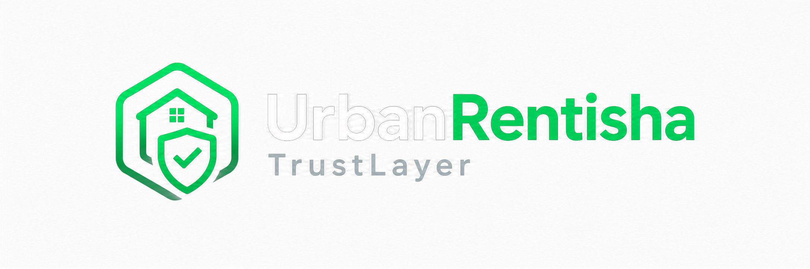

# 🛡️ Security Policy

---

## 📦 Supported Versions

| Component | Stack | Supported |
|---|---|---|
| Backend (NestJS) | Node 20.x, NestJS 10.x | ✅ |
| Frontend (Next.js) | Next.js 16.x, React 19.x | ✅ |
| Trust verifier contract | Rust, `soroban-sdk` 25.x | ✅ |
| ZK circuit | Circom 2.1.0, BLS12-381 | ✅ |
| Database | Prisma 5.x + PostgreSQL (Supabase) | ✅ |

This is an active hackathon MVP, not a versioned product — "supported" means "this is the version currently deployed and reviewed," not a long-term support guarantee.

---

## 🔐 What's Actually Secured

This section only lists controls that are implemented and verified in this repo — not aspirational claims.

- 🔑 **Rate limiting** on `/auth/login` and `/auth/register` (5 req/min via `@nestjs/throttler`), global default of 60 req/min on every other endpoint.
- 📝 **Audit logging** on every login attempt (success, wrong password, unknown email, suspended account) and every registration — see `auth.service.ts`.
- 🧪 **Password hashing** via `bcryptjs`, never stored or logged in the clear.
- 🚫 **No user enumeration** — login returns the identical generic error for an unknown email and a wrong password.
- 🔒 **JWT auth + role-based guards** (`JwtAuthGuard`, `RolesGuard`) on every non-public route.
- ✅ **Strict input validation** — global `ValidationPipe({ whitelist: true, forbidNonWhitelisted: true })`, every `@Body()` is a typed, validated DTO.
- 🧮 **On-chain proof verification** — the Soroban contract performs real BLS12-381 pairing checks (`env.crypto().bls12_381()`), not a stub.
- 🔗 **One-way payment commitment** — `MiMCPermutation`, 220 rounds, sized to resist algebraic-attack recovery of the private witness (see [docs/zkproof](docs/zkproof/UrbanRentisha_TrustLayer_ZK_Proof_Documentation.md) §6.2 for the full security writeup, including an earlier non-binding relation that was caught and replaced).
- 🗄️ **Database-level constraints** — foreign-key indexes, enum-typed status columns instead of unconstrained strings, `@unique` on the API key hash.

---

## ⚠️ Known, Documented Limitations

Honesty over polish — these are real, current gaps, not hidden:

- 🧪 The MiMC permutation is a self-contained construction sized to match circomlib's documented security margin — **not an independently audited Poseidon/MiMC parameter set.**
- 🎥 No production deployment hardening review has been done — this is a Stellar **testnet** MVP, not mainnet-ready.
- 📊 Test coverage exists for the ZK commitment logic, escrow arithmetic, and the full auth flow — broader backend coverage is still thin.
- 🔓 Secret keys are never sent to the frontend and never committed — but no formal secrets-management/rotation process exists yet beyond `.env`.

---

## 🚨 Reporting a Vulnerability

**Do not open a public GitHub issue for security vulnerabilities.**

| Channel | Contact |
|---|---|
| 📧 **Email** | [mokwaohuru@gmail.com](mailto:mokwaohuru@gmail.com) |
| 🏷️ **Subject line** | `[SECURITY] UrbanRentisha TrustLayer — <brief description>` |

Please include: affected component, reproduction steps, and impact. This is a solo-built hackathon project — response time is best-effort, not SLA-backed.
