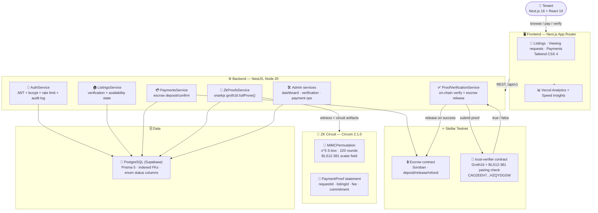

# 🏗️ UrbanRentisha TrustLayer — Technical Architecture & Stack

### *Privacy-preserving rental trust infrastructure on Stellar*

---

## 📐 System Architecture

---

## 🧩 Component Breakdown

### 🖥️ Frontend

| Layer | Choice | Why |
|---|---|---|
| Framework | Next.js 16 (App Router) | File-based routing, server components, built-in `manifest.ts`/`robots.ts`/`sitemap.ts` |
| UI | React 19 + Tailwind CSS 4 | Fast iteration on a brand-token design system (`--color-ur-*`) |
| Fonts | `next/font/google` (Inter, JetBrains Mono) | Self-hosted at build time, no runtime Google Fonts round-trip |
| Icons | Self-hosted, subsetted Material Symbols (`scripts/subset-icon-font.cjs`) | 475KB → 380KB, only the 75 glyphs actually used, no third-party font CDN call |
| Analytics | `@vercel/analytics` + `@vercel/speed-insights` | Zero-config on an already-Vercel-linked project |

### ⚙️ Backend

| Layer | Choice | Why |
|---|---|---|
| Framework | NestJS 10, TypeScript | Modular DI, guards/pipes fit the role-based access model |
| ORM | Prisma 5 + PostgreSQL (Supabase) | Type-safe queries, migration history, indexed FKs |
| Auth | `@nestjs/jwt`, `bcryptjs`, `@nestjs/throttler` | JWT sessions, hashed passwords, rate-limited login/register |
| Validation | `class-validator` + global `ValidationPipe` | Every request body is a typed, whitelisted DTO |
| Stellar SDK | `@stellar/stellar-sdk` | Wallet generation, testnet funding, transaction building |

### 🧮 Zero-Knowledge

| Layer | Choice | Why |
|---|---|---|
| Circuit language | Circom 2.1.0 | Direct, auditable constraint authoring; official Stellar Groth16 reference path |
| Proof system | Groth16 (`snarkjs`) | Small proofs, cheap on-chain pairing verification |
| Curve | BLS12-381 | Matches Stellar's native `env.crypto().bls12_381()` host functions and the official `soroban-examples/groth16_verifier` reference |
| Commitment | `MiMCPermutation`, `x^5` S-box, 220 rounds | One-way binding of the private (secret, nonce) witness — round count sized so `5^rounds` exceeds the field size, resisting algebraic-attack recovery |

### ⭐ Stellar / Soroban

| Layer | Choice | Why |
|---|---|---|
| Contract language | Rust, `soroban-sdk` 25.1.0 | Native BLS12-381 host functions (`g1_mul`, `g1_add`, `pairing_check`) |
| Network | Stellar testnet | Real, deployed, no production funds at risk |
| Verifier design | VK passed as a call parameter, not contract state | Circuit/VK can change without redeploying the contract |

---

## 🔬 Why These Choices, Specifically

- **Circom over Noir:** Noir's UltraHonk verifier for Soroban only exists as a third-party fork (`yugocabrio/rs-soroban-ultrahonk`) — higher integration risk under a deadline. Circom + Groth16 has an official Stellar-maintained reference verifier.
- **BLS12-381 over BN254:** Stellar's newer BN254 host functions (Protocols 25/26) are a valid path too, but BLS12-381 predates them and is the curve Stellar's own canonical example targets — not a fallback, the reference path.
- **220-round MiMC, not 12:** an earlier revision used 12 rounds — `5^12 ≈ 2^28`, far short of the `~2^255` needed for this field. Caught via direct calculation against circomlib's own documented margin (`log_5(field) ≈ 110 → use 220`), fixed before this submission.
